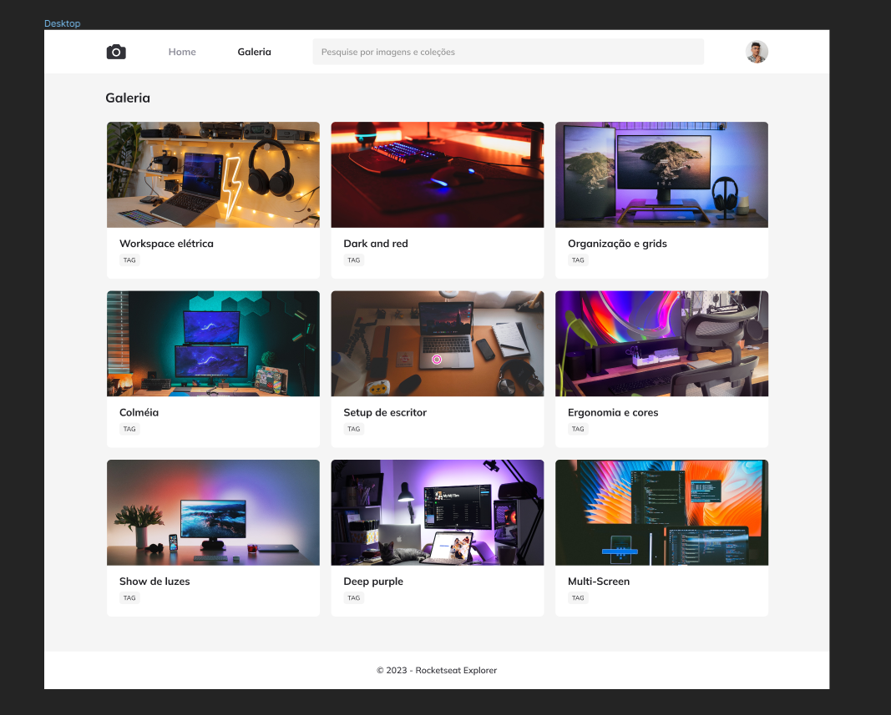

<h1 align="center"> Photo Blog - Projeto 07 </h1>

  <a href="#-tecnologias">Tecnologias</a>&nbsp;&nbsp;&nbsp;|&nbsp;&nbsp;&nbsp;
  <a href="#-projeto">Projeto</a>&nbsp;&nbsp;&nbsp;|&nbsp;&nbsp;&nbsp;
  <a href="#-layout">Layout</a>&nbsp;&nbsp;&nbsp;

 

## 🚀 Tecnologias

Esse projeto foi desenvolvido com as seguintes tecnologias:

- HTML e CSS
- Figma

## 💻 Projeto

O intuito desse desafio era replicar um layout utilizando um grid e aplicando alguns filtros de CSS proposto pela RocketSeat

Proposta:

  

## ✅ Resultado
- [Acesse o resultado finalizado do Projeto 06, online](https://devbonatto.github.io/PhotoBlog-Projeto07/)

## 🔖 Layout

Você pode visualizar o layout do projeto através [DESSE LINK](https://www.figma.com/community/file/1256354844988182987/fotoblog-projeto-explorer)
